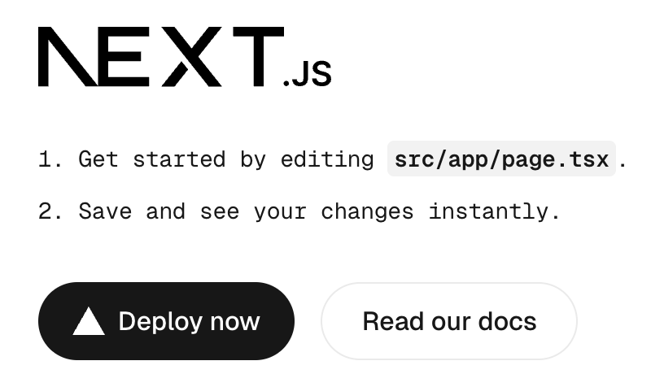
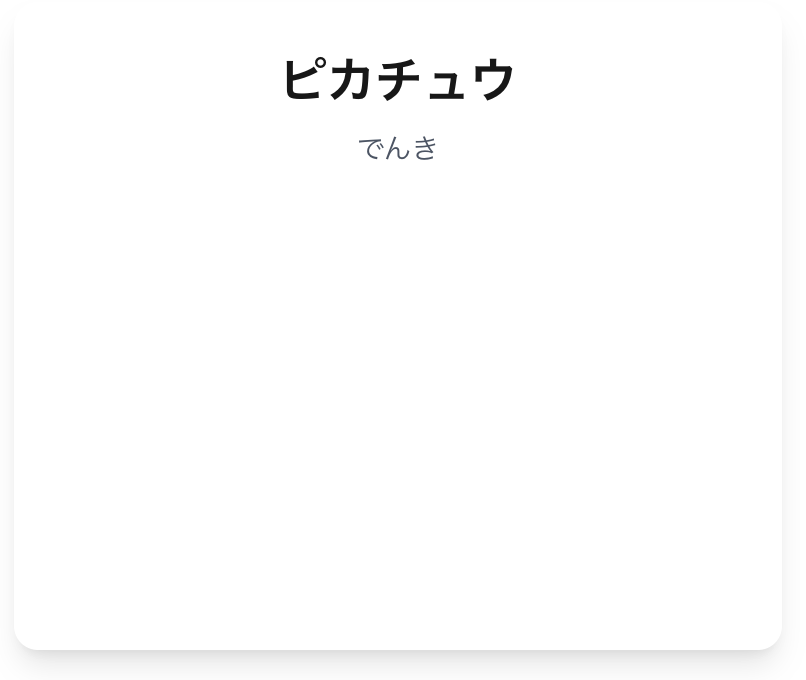
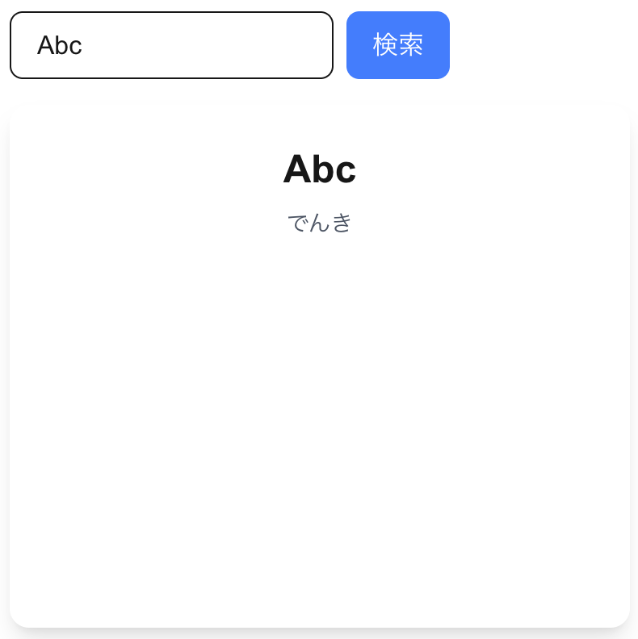
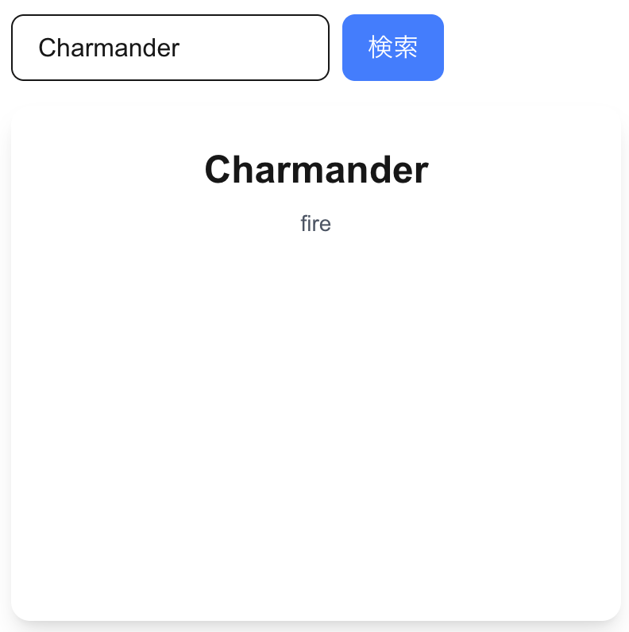
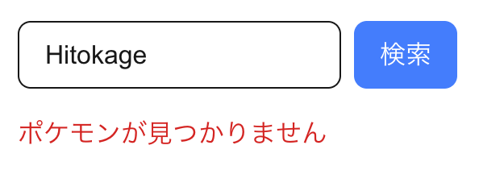

# pokemon-search1

本プロジェクトは Next.js を使って簡単なウェブアプリケーションを作ってみるチュートリアルです。

バックエンドには [PokeAPI](https://pokeapi.co/) を使用します。

## 準備

下記をインストールしておいてください

-   Node.js 18.18 以降

## STEP1: アプリケーションの作成

ターミナルから下記コマンドを実行し、Next.js アプリケーションを作成します。

```
npx create-next-app@latest pokemon-search1 --ts --tailwind --eslint --src-dir --app --import-alias '@/*' --turbopack
```

`npx create-next-app@latest`で対話型でオプションを指定することも可能ですが、コマンドラインのオプションで下記のような指定を行っています。

-   ts: TypeScript を使用
-   tailwind: CSS のフレームワークに [Tailwind CSS](https://tailwindcss.com/) を使用
-   eslint: 静的解析に [ESLint](https://eslint.org/) を使用
-   src-dir: コードを src フォルダ下に格納
-   app: Next.js のルーティングに App Router を使用
-   import-alias: import に @ などの alias を使用可能とする
-   turbopack: バンドラーに Turbopack を使用

pokemon-search1 フォルダ下にアプリケーションが作成されます。  
pokemon-search1 フォルダ下に移動し、アプリケーションを起動します。

```
cd pokemon-search1
npm run dev
```

起動後、ブラウザで http://localhost:3000 にアクセスすると下記のようなページが表示されます。



## STEP2: ポケモンの表示

トップページにポケモンを表示してみましょう。

page.tsx の内容を下記のように変更します。

```typescript
import Image from 'next/image';

export default function Home() {
    return (
        <div className="min-h-screen p-8">
            <div>
                <div>ピカチュウ</div>
                <div>でんき</div>
                <Image
                    src="https://raw.githubusercontent.com/PokeAPI/sprites/master/sprites/pokemon/other/official-artwork/25.png"
                    alt="ピカチュウ"
                    width={200}
                    height={200}
                />
            </div>
        </div>
    );
}
```

next/image コンポーネントに使用するホストとして `https://raw.githubusercontent.com` を追加します。

```
const nextConfig: NextConfig = {
    images: {
        remotePatterns: [new URL('https://raw.githubusercontent.com/**')],
    },
};
```

ブラウザでポケモンの名称、タイプ、画像が表示されていることを確認してください。

## STEP3: コンポーネントの作成

1 体のポケモンの表示を箇所を 1 コンポーネントとして分離します。

src フォルダ下に components フォルダを作成し、PokemonCard.tsx というファイルを作成します。

ファイルの内容は下記のようにします。  
親コンポーネントから受け取る props として name、types、imageUrl を定義しています。

```
import Image from 'next/image';

interface PokemonCardProps {
    name: string;
    types: string[];
    imageUrl: string;
}

export default function PokemonCard({
    name,
    types,
    imageUrl,
}: PokemonCardProps) {
    return (
        <div>
            <div>{name}</div>
            <div>{types.join(', ')}</div>
            <Image src={imageUrl} alt={name} width={200} height={200} />
        </div>
    );
}
```

page.tsx を上記 PokemonCard を呼び出す形式に変更します。

```
import PokemonCard from '../components/PokemonCard';

export default function Home() {
    return (
        <div className="min-h-screen p-8">
            <PokemonCard
                name="ピカチュウ"
                types={['でんき']}
                imageUrl="https://raw.githubusercontent.com/PokeAPI/sprites/master/sprites/pokemon/other/official-artwork/25.png"
            />
        </div>
    );
}
```

ブラウザで STEP2 と同様の表示となっていることを確認してください。

## STEP4: Tailwind CSS による装飾

PokemonCard コンポーネントに下記のようなスタイルの指定を追加してみましょう。

-   全体をカードっぽく丸角にして、シャドウを付ける
-   カード内をセンタリングする
-   名前は太字で大きく表示
-   タイプはグレーで小さく表示
-   余白を追加

Tailwind CSS では className に CSS を簡素化したユーティリティクラスを指定します。  
下記のように className を追加します。

```
    return (
        <div className="flex flex-col items-center p-6 rounded-xl shadow-lg bg-white w-96">
            <div className="text-2xl font-bold mb-2">{name}</div>
            <div className="text-sm text-gray-600 mb-4">{types.join(', ')}</div>
            <Image src={imageUrl} alt={name} width={200} height={200} />
        </div>
    );
```

ブラウザで 指定通りの表示となっていることを確認してください。  
(下図ではポケモン画像はカットしています)



## STEP5: ポケモン検索用コンポーネントの作成

これまでは特定のポケモンを表示するだけでしたが、ポケモンの名前を入力して検索できるようにします。

まず、検索 UI となる PokemonSearch コンポーネントを追加します。  
components フォルダ下に PokemonSearch.tsx というファイルを作成します。

ファイルの内容は下記のようにします。  
親コンポーネントから受け取る props として onSearch というコールバック関数を定義しています。  
input 要素に入力したポケモン名を searchName という state 変数に保持します。  
submit ボタンが押されると、searchName を引数にして onSearch を呼び出します。

```
'use client';

import { useState } from 'react';

interface PokemonSearchProps {
    onSearch: (pokemonName: string) => void;
}

export default function PokemonSearch({ onSearch }: PokemonSearchProps) {
    const [searchName, setSearchName] = useState('');

    const handleSubmit = (e: React.FormEvent) => {
        e.preventDefault();
        onSearch(searchName);
    };

    return (
        <form onSubmit={handleSubmit} className="flex gap-2 mb-4">
            <input
                type="text"
                value={searchName}
                onChange={(e) => setSearchName(e.target.value)}
                placeholder="ポケモン名を入力"
                className="px-4 py-2 border rounded-lg max-w-96"
            />
            <button
                type="submit"
                className="px-4 py-2 bg-blue-500 text-white rounded-lg hover:bg-blue-600"
            >
                検索
            </button>
        </form>
    );
}
```

次に親コンポーネント側を修正します。
親コンポーネントでは、PokemonSearch に渡すコールバック関数を実装します。  
コールバック関数ではポケモンの検索を行いますが、このステップでは検索は行わず、入力されたポケモン名を表示するだけとします。

親コンポーネントを修正するにあたり、ポケモンデータの受け渡しのため、Pokemon という型を新たに定義します。
src フォルダ下に types フォルダを作成し、pokemon というファイルを作成します。
ファイルの内容は下記のようにします。

```
export type Pokemon = {
    name: string;
    types: string[];
    imageUrl: string;
};
```

PokemonCard の props も Pokemon を受け取る形に変更します。

```
import { Pokemon } from '@/types/pokemon';
import Image from 'next/image';

interface PokemonCardProps {
    pokemon: Pokemon;
}

export default function PokemonCard({ pokemon }: PokemonCardProps) {
    return (
        <div className="flex flex-col items-center p-6 rounded-xl shadow-lg bg-white w-96">
            <div className="text-2xl font-bold mb-2">{pokemon.name}</div>
            <div className="text-sm text-gray-600 mb-4">
                {pokemon.types.join(', ')}
            </div>
            <Image
                src={pokemon.imageUrl}
                alt={pokemon.name}
                width={200}
                height={200}
            />
        </div>
    );
}
```

親コンポーネントを修正します。  
検索したポケモンのデータを保持するため、searchedPokemon という state 変数を追加します。
コールバック関数から渡されたポケモン名はこの変数の name にセットします。
ポケモン名が空の場合は searchedPokemon を null とし、PokemonCard を表示しないようにします。
検索処理を実装していないため、types や imageUrl の情報がありませんが、ひとまずこれまで使用してきたデータを入れておきます。  
全体のコードは下記のようになります。

```
'use client';

import { useState } from 'react';
import PokemonCard from '../components/PokemonCard';
import PokemonSearch from '../components/PokemonSearch';
import { Pokemon } from '@/types/pokemon';

export default function Home() {
    // 検索されたポケモンの情報を状態として保持
    const [searchedPokemon, setSearchedPokemon] = useState<Pokemon | null>(
        null
    );

    const handleSearch = (searchName: string) => {
        if (!searchName) {
            // 入力が空の場合は検索結果をクリア
            setSearchedPokemon(null);
            return;
        }
        // TODO: 後でPokeAPIを使用してポケモンデータを取得する処理を追加。ひとまずname以外は固定データを使用。
        setSearchedPokemon({
            name: searchName,
            types: ['でんき'],
            imageUrl:
                'https://raw.githubusercontent.com/PokeAPI/sprites/master/sprites/pokemon/other/official-artwork/25.png',
        });
    };

    return (
        <div className="min-h-screen p-8">
            <PokemonSearch onSearch={handleSearch} />
            {searchedPokemon && <PokemonCard pokemon={searchedPokemon} />}
        </div>
    );
}
```

ブラウザで動作確認します。  
ポケモン名を入力していなければ PokemonCard は表示されず、ポケモン名を入力して検索ボタンを押すと、入力内容が反映された PokemonCard が表示されます。



## STEP6: PokeAPI による検索

PokeAPI を使って、ポケモンの名前から情報を取得できるようにします。

検索には下記 API を使用します。

```
GET https://pokeapi.co/api/v2/pokemon/{id or name}/
```

name は英語の名前にしか対応していません。

HTTP 通信は標準の fetch でも行えますが、ここでは、axios というライブラリを使用します。  
ターミナル上の pokemon-search1 フォルダ下で下記コマンドを実行し、axios をインストールしてください。

```
npm i axios
```

page.tsx で利用するため、page.tsx に axios の import 文を追加します。

```
import axios from 'axios';
```

page.tsx に検索処理を行う非同期関数 searchPokemon を追加します。  
API のレスポンスからタイプと画像の情報を抽出して Pokemon 型のデータを作成、返却します。  
axios.get はすぐには結果が返らない非同期関数です。  
await を使うことにより、結果が返るのを待って値を取得することができます。  
API のエラー処理は try...catch の catch ブロックで行います。

```
    const searchPokemon = async (name: string): Promise<Pokemon> => {
        try {
            const res = await axios.get(
                `https://pokeapi.co/api/v2/pokemon/${name.toLowerCase()}`
            );
            const data = res.data;
            return {
                name,
                types: data.types.map(
                    (typeInfo: { type: { name: string } }) => typeInfo.type.name
                ),
                imageUrl: data.sprites.other['official-artwork'].front_default,
            };
        } catch (err: unknown) {
            // axios のレスポンスがあり 404 の場合は「見つかりません」エラーを投げる
            if (axios.isAxiosError(err) && err.response?.status === 404) {
                throw new Error('ポケモンが見つかりません');
            }
            throw err;
        }
    };
```

前のステップで作成した handleSearch を searchPokemon を使って検索するように修正します。

その前に、searchPokemon が返したエラーを表示するための仕組みを作成しておきます。  
エラーメッセージを保持する state 変数を追加します。

```
    // ページ内に表示するエラーメッセージ
    const [errorMessage, setErrorMessage] = useState<string | null>(null);
```

JSX 側に表示する要素を追加します。

```
        <div className="min-h-screen p-8">
            <PokemonSearch onSearch={handleSearch} />
            {searchedPokemon && <PokemonCard pokemon={searchedPokemon} />}
            {errorMessage && (
                <div className="mb-4 text-red-600 font-medium">
                    {errorMessage}
                </div>
            )}
        </div>
```

searchPokemon、setErrorMessage を使って検索処理を行うように handleSearch を修正します。  
handleSearch も async を付与して非同期関数に変更します。

```
    const handleSearch = async (searchName: string) => {
        if (!searchName) {
            // 入力が空の場合は検索結果をクリア
            setSearchedPokemon(null);
            setErrorMessage(null);
            return;
        }
        try {
            const pokemon = await searchPokemon(searchName);
            setSearchedPokemon(pokemon);
            setErrorMessage(null);
        } catch (error) {
            if (error instanceof Error) {
                setErrorMessage(error.message);
            } else {
                setErrorMessage('予期せぬエラーが発生しました');
            }
            setSearchedPokemon(null);
        }
    };
```

ブラウザで動作確認します。  
ポケモン名に「Charmander」と入力して検索ボタンを押します。  
検索が成功すると、対応する PokemonCard が表示されます。



次に、ポケモン名に API が対応していない「Hitokage」を入力して検索ボタンを押します。  
エラーメッセージが表示されます。



## STEP7: タイプの日本語表示

PokeAPI で返るタイプは「fire」といった英語表記ですが、これを日本語で表示できるようにします。

まず、英語->日本語の翻訳ファイルを作成します。  
types フォルダ下に下記のような内容の typeNames.json を作成します。

```
{
    "normal": "ノーマル",
    "fire": "ほのお",
    "water": "みず",
    "grass": "くさ",
    "electric": "でんき",
    "ice": "こおり",
    "fighting": "かくとう",
    "poison": "どく",
    "ground": "じめん",
    "flying": "ひこう",
    "psychic": "エスパー",
    "bug": "むし",
    "rock": "いわ",
    "ghost": "ゴースト",
    "dragon": "ドラゴン",
    "dark": "あく",
    "steel": "はがね",
    "fairy": "フェアリー"
}
```

PokemonCard コンポーネントで英語->日本語変換を行います。
typeNames.json を import します。

```
import typeNames from '@/types/typeNames.json';
```

タイプの英語->日本語変換を行う関数 translateTypes を追加します。

```
function translateTypes(types: string[]) {
    return types
        .map((t) => {
            const key = t.toLowerCase();
            return (typeNames as Record<string, string>)[key] ?? 'ふめい';
        })
        .join('、');
}
```

translateTypes の結果を表示するように変更します。

```
            <div className="text-sm text-gray-600 mb-4">
                {translateTypes(pokemon.types)}
            </div>
```

ブラウザで動作確認します。  
ポケモン名に「Charmander」と入力して検索ボタンを押します。  
タイプが「ほのお」と表示されます。


